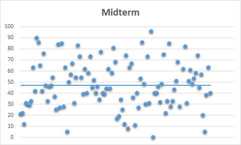

## Lecture Information & Schedule

### Lecture 1: Introduction

#### March 5, 2018

This is an introductory lecture aiming on explaning what is Discrete Mathematics, what kind of problems we will encounter and what is the strategy to solve them. Example problems： stable marriage problem and the deferred acceptance algorithm, which is related to the 2012 Nobel Prize in Economics, the [Sierpiński curve](https://en.wikipedia.org/wiki/Sierpi%C5%84ski_curve), the [seven bridges of Königsberg](https://en.wikipedia.org/wiki/Seven_Bridges_of_K%C3%B6nigsberg), and [Kirkman's schoolgirl problem](https://en.wikipedia.org/wiki/Kirkman%27s_schoolgirl_problem). Course syllabus and how to excel in it.

Further recommended reading: 
+ David Austin, [The stable marriage problem and school choice](http://www.ams.org/publicoutreach/feature-column/fc-2015-03). The article is in English and pretty long, but please do not be terrified. I hope that you can enjoy the process of trying to read (even small parts) of it!
+ 如果你喜欢玩旅行青蛙（旅かえる），不妨读一下这篇[技术分析](https://www.zhihu.com/question/68733553/answer/305463907)。以后我们会学到图论和相关算法。

### Lecture 2, 3, 4: Sets, Logic and Boolean Algebras

Lecture notes can be found [here](/Lecture_Notes.pdf): last updated: Mar 16, 2018. 

**集合论：教材3-1, 3-2, 3-4。集合论中包括可数集和映射的概念，见教材4-4, 4-5。数理逻辑：教材第一章（除1-6, 1-8, 1-9），第二章（除2-7。布尔代数：教材6-4（书上这一部分需要的铺垫概念过多，不建议阅读，请参照讲义）。**

#### March 9, 2018

An introductory lecture about set theory (集合论) and propositional logic (命题逻辑). We started from the relevant definition about sets, various m-nary operations (m元运算) and results about commutativity 交换性/律, associativity 结合性/律 and distributivity 分配性/律. The motivation of propositional logic, various m-nary operations on it, and the truth table 真值表.

Recommended exercise:
+ **Finish the exercises given during the lecture.**
+ **阅读教材的相关内容————对同样的内容通过不同的方式（听课，阅读不同版本的文献，查询[Wikipedia](https://en.wikipedia.org/)等等）进行学习可以加深理解，巩固基础。**

#### March 12, 2018

Implication 条件 and bicondition 双条件; statements viewed as "constant" operations and the tree graph to denote compound operations (复合运算). Boolean algebras 布尔代数, revisiting the example from set theory and propositional logic, and its theoretical importance. Then we moved to the introduction of predicate logic 谓词逻辑.

#### March 16, 2018

Predicate logic: the quantifiers 量词, their domain 辖域 and computation rules; Exercises; further applications: Island with inhabitants, logic circuit, and [Sudoku](https://en.wikipedia.org/wiki/Sudoku).

[Problem Set 1, due March 23](/homework_set_1.pdf) —— 请用白色A4至A5大小的白色纸张书写，若多于一页请订起来以免散失。由于课程人数众多，为了批改和收发方便，请一定不要直接上交作业本。多谢理解！

一班的同学：课上关于布尔代数的例题，证明过程中用到的结果补在[讲义](/Lecture_Notes.pdf)第四页下方，抱歉给你们造成的困扰！

### Lecture 5, 6, 7, 8: Proof and Algorithms

Lecture notes can be found [here](/Lecture_Notes_1.pdf): last updated: Mar 30, 2018. 

**KMP算法相关的移动表格见讲义，配边表格见[参考文献](http://www.inf.fh-flensburg.de/lang/algorithmen/pattern/kmpen.htm)**

#### March 19, 2018
This is an introductory lecture about theory of proofs. Firstly we shall introduce the axiomatic (公理化的) formulation of mathematical theories, and give examples. Then, several ways of giving proofs. Lastly, we shall introduce the Well-ordered Principle (WOP，良序原理), the Mathematical Induction (MI，数学归纳法) and the Complete Induction (CI，完全归纳法) and show their equivalence.  

Recommended reading:
+ Read about the [common proof strategies](http://www.mathcs.bethel.edu/~gossett/DiscreteMathWithProof/ProofStrategies.pdf) and the [common errors in proof](http://www.mathcs.bethel.edu/~gossett/DiscreteMathWithProof/CommonErrorsInProofs.pdf). Try to come up with more items to the lists if you can.
+ **阅读教材 1-8 (pp. 40) 和 2-7 (pp. 75) 相关部分.**

#### March 23, 2018

Computability and provability: Sequence, programs, partial functions, Halting problem, Goedel's incompleteness theorems. Some relevant materials of the lecture can be found [here](http://www.math.hawaii.edu/~dale/godel/godel.html).

Further Reading:
+ If you are curious and ambitious, try to read [the AMS notes by Martin Davis](http://www.ams.org/notices/200604/fea-davis.pdf).

#### March 26, 2018

Two ways of encoding finite sequences in natural numbers: prime factorization and Goedel's function (using Chinese Remainder Theorem 中国剩余定理). Complexity (复杂度) of algorithms and counting critical operations (关键操作). Then we shall focus on the example of searching and pattern matching problems 模式匹配, the corresponding algorithms involve sequential search 顺序搜索, binary searching 二分法搜索.

[Problem Set 2, due April 8](/homework_set_2.pdf) —— 请用白色A4至A5大小的白色纸张书写，若多于一页请订起来以免散失。由于课程人数众多，为了批改和收发方便，请一定不要直接上交作业本。多谢理解！

作业提示：有些代码中critical operations可能不止一个，在这种情况下需要针对每一个critical operation计算执行的具体次数。例如，2(c)中第7，8和9行的操作都是critical operation。

#### March 30, 2018

Pattern matching: Knuth-Morris-Pratt --- I loosely follow the **notes of Hans Werner Lang (关于配边的理论请参考这个), which you can find [here](http://www.inf.fh-flensburg.de/lang/algorithmen/pattern/kmpen.htm).** The border (配边) is a special repeating structure one can find on a string 字串, or a substring 子串. In our case, we are interested in the borders 配边 of preffix 前缀 of a pattern. The KMP algorithm consists of two parts: the computation of the table b\[m\] and the searching part.

计算b[m]代码的简单解释：假设我们已知b[0]到b[i]的值，也就知道了p[m]中p[i]之前的前缀所含有的最大配边(border)。那么p[0:i]（亦即由p[0], p[1],...,p[i]组成的前缀）的最大配边要么从p[0:(i－1)]的最大配边被p[i]延伸(extend)出来，或者是从p[0:(i－1)]的小一些的配边被p[i]延伸(extend)出来。可以延伸的语句判定就是p[i]==p[j]，而如果最大配边不能延伸，寻找次一级配边的长度，则需要用到j=b[j]语句。

Further readings:
+ [Boyer-Moore algorithm](http://www.inf.fh-flensburg.de/lang/algorithmen/pattern/bmen.htm), which is considered to be the most efficient method. It combines the shift table method as in KMP (although the comparison is right-to-left), as well as the last table. 阅读提示：我们课上没有讲KMP中shift table的计算代码。但在BM算法中bmPreprocess1()和bmPreprocess2()给出了怎样由配边理论得出shift table的代码；这段代码有助于理解为什么KMP算法亦可以由shift table构造。
+ 这两种算法的中文资料颇多，请有兴趣的同学自行选阅文献，不再赘述。

### Lecture 9, 10, 11, 12, 13: Recursion and the theory of Automata

Lecture notes on recursion can be found [here](/Lecture_Notes_2.pdf): last updated: Apr 7, 2018. For formal language and automata part, please refer to Section 8-1, 8-2 and 8-6 of the textbook.

**形式语言和自动机部分详见教材8-1, 8-2 和 8-6。**

#### April 2, 2018

Reviewing the KMP algorithms, and the instruction for the second homework. Then we moved to the new section on recursion 递归/迭代, its application in programming, and then the recursive sequence. For homognenous (齐次) linear recursive relation of degree k, there is a general method of solving it using character equation (特征方程), given that the character equation (degree k) has k distinct roots 非重根.

#### April 8, 2018

Continue on the recursive relation: solving them using generating functions （发生函数/生成函数/母函数）. The general theory of generating functions, manipulations involving shifting 向右移, multiplication 相乘 and derivation 导数. Examples of solving non-honogeneous, non-constant coefficient (变系数的) recursive relations.

Recommended Reading:
+ **The general theory of generating functions is also covered in [this notes](https://ocw.mit.edu/courses/electrical-engineering-and-computer-science/6-042j-mathematics-for-computer-science-fall-2005/readings/ln11.pdf), so if you are not sure about what we covered in class, please refer to it. **
+ **Please make sure that you could follow all the calculation examples showed in class.**

#### April 9, 2018

We introduced the theory of formal languages 形式语言, the binary (二元) and unary (一元) operation on them, and the compatibility. Then we started to talk a bit about formal grammar 形式文法. 

Recommended Readings:
+ **阅读教科书第八章前两节的内容，证明定理8-1.4。**
+ There are many interesting [applications](http://web.cs.ucdavis.edu/~rogaway/classes/120/spring13/eric-dfa.pdf) of the theory of automata, even in [Biology](https://en.wikipedia.org/wiki/Conway%27s_Game_of_Life).

[Problem Set 3, due April 20](/homework_set_3.pdf) —— 请用白色A4至A5大小的白色纸张书写，若多于一页请订起来以免散失。由于课程人数众多，为了批改和收发方便，请一定不要直接上交作业本。多谢理解！

#### April 13, 2018
Context-Free (CF) Grammar 上下文无关文法, and Regular Grammar and Regular Languages 正则文法和正则语言. Examples involve the left-(resp. right-)most linear derivation grammar 左（右）线性文法. Finite Automata, including the Deterministic Finite Automata (DFA，确定的有限状态接收器) and the Nondeterministic Finite Automata (NFA，不确定的有限状态接收器), their acceptible languages. Theorem 1 says that {L(M)\|M is any NFA} is a subset of {L(M)\|M is any DFA}. Then Kleene's theorem gives the equivalences of the aforementioned two sets, and with the RCF language, i.e., {L(G)\|G is any Regular Grammar}.

注意：DFA和NFA对应于教材8-6中定义的两类状态接收器，唯一的曲别在于，教材要求初态是一个态的集合，而我们只要求是一个态。但核心定理的证明思路不变，我们课上讲的情况更为简洁，且与教材中的定义等价。

Recommended Readings:
+ 关于自动机理论的应用，参见上次课给的阅读建议。
+ **这一部分内容会应用集合论的基本知识，建议复习以前集合论讲过的内容，并阅读教材第三章的相关章节。**

#### April 16, 2018

Finishing up the proof of Kleene's theorem, Pumping lemma 泵引理, Turing Machine, P and NP complexity.

教材中355页对于正则文法的定义有误。正则文法分为左（派生）正则文法和右（派生）正则文法两种，分别对应于生成式形右端的非终结符在最左侧和在最右侧两种情形。这两种文法都可以被线性化，对应于左线性文法和右线性文法。

Recommended Readings:
+ **Kleene定理的证明教材8-6亦有给出。**
+ 关于泵引理的证明和应用，见[这里](https://baike.baidu.com/item/%E6%B3%B5%E5%BC%95%E7%90%86)。
+ If you have time and are interested, read about [Turing Machine](https://zh.wikipedia.org/wiki/图灵机) and [P/NP problem](https://zh.wikipedia.org/zh-hans/P/NP问题).

### Lecture 14, 15, 16: Basic Combinatorics

Lecture notes can be found [here](/Lecture_Notes_3.pdf): last updated: Apr 28, 2018. 

#### April 20, 2018

Enumeration problem and [Stirling numbers](https://en.wikipedia.org/wiki/Stirling_number). Paritition of positive integers 正整数的剖分, p(n) and p(n,k), the generating function and recursive relation. Partition of sets, the second Stirling number S(n,k), and recursive relation.

#### April 23, 2018

Both p(n,k) and S(n,k) have interpretation as the number of solutions to the occupation problem 分配问题, which can be more generally formulated. Then we shall briefly mention the first Stirling number s(n,k).

Combinatorial designes: [Latin square(拉丁方)](https://zh.wikipedia.org/zh-hans/拉丁方陣): definition and results about orthogonality.

#### April 27, 2018

The use of Latin square. Then we started the introduction on [finite projective planes(有限射影平面)](https://en.wikipedia.org/wiki/Finite_geometry#Finite_projective_planes), the axiomatic formulation and the duality (对偶). The FPP can be be characterized by its order n, where each of its line contains exactly n+1 points. The existence of an order n FPP is equivalent to the existence of n-1 mutually orthogonal (两两正交) n-by-n Latin squares.

Due to the time constraints, we shall not mention the last bit of the story: combinatorical optimizational theory 组合优化理论: [Knapsack problem](https://en.wikipedia.org/wiki/Knapsack_problem). But you are more than welcome to explore by yourself!

[Problem Set 4, due May 4](/homework_set_4.pdf) —— 请用白色A4至A5大小的白色纸张书写，若多于一页请订起来以免散失。由于课程人数众多，为了批改和收发方便，请一定不要直接上交作业本。多谢理解！

Further Readings:
+ The area of finite geometry is related to other branches of combinatorics (for example the BIBD) as well as number theory, see the [wikipedia page](https://en.wikipedia.org/wiki/Finite_geometry) and the [AMS essay](http://www.ams.org/publicoutreach/feature-column/fcarc-finitegeometries) for some nice, non-technical overview. 
+ 有限几何学以及应用，[百度页面](https://baike.baidu.com/item/有限几何).

### Lecture 17, 18: Midterm Overview

#### April 28, 2018

We summarized set theory and its relevant appearances in Boolean algebra and the theory of formal languages. (Note that also the statements of finite projective plane can be phrased entirely using set theory.) Then we reviewed the exercises on parrtern matching: the obvious algorithms and the KMP.

#### May 4, 2018

Homework on recursive relation, the theory of automata, and basic combinatorics.

### Lecture 19: Post-midterm Recapture

#### May 18, 2018

We will review the midterm exam. 

关于计算题第二题，见[第3次作业中练习题第5题的答案](solps3ex5.pdf)

### Lecture 20, 21, 22, 23, 24: Graph Theory and Trees

For this section we shall closely follow the textbook, so there is no lecture notes.

#### May 25, 2018

Definitions, Simple graph, degree of a vertex, operations on graphs: subgraph, and complement of a graph. The "handshake" theorem: the total degree of a graph equals to twice of the edge number. Connectivity of a graph, the cut edge and the cut vertex.

#### June 1, 2018

Edge and vertex connectivity and the inequality between them. Euler trails and Euler circuits. Hamilton cycles.

[Problem Set 5, due June 8](HW5.pdf) —— 请用白色A4至A5大小的白色纸张书写或者打印，若多于一页请订起来以免散失。由于课程人数众多，为了批改和收发方便，请一定不要直接上交作业本。多谢理解！

#### June 8, 2018

Class cancelled due to typhoon. The due date of 5th homework is postponed to next Friday.

#### June 15, 2018

Planar graph, Euler's formula, and the edge number bound about the connected, simple planar graphs. Dual graph.

Recommended Readings:
+ Read about the chromatic problem of graph theory, see for example  7-6 of textbook.
+ There are many applications of graph theory in computer science. For example, the [Dijkstra algorithm](https://zh.wikipedia.org/wiki/%E6%88%B4%E5%85%8B%E6%96%AF%E7%89%B9%E6%8B%89%E7%AE%97%E6%B3%95) computes the shortest path between two vertices of a weighted, connected, simple graph. This is also the algorithm used in 旅かえる.

[Problem Set 6, due June 22]() —— 请用白色A4至A5大小的白色纸张书写或者打印，若多于一页请订起来以免散失。由于课程人数众多，为了批改和收发方便，请一定不要直接上交作业本。多谢理解！

#### June 22, 2018

### Lecture 25, 26: Functions and Relations

#### June 29, 2018

#### July 6, 2018

[Problem Set 7, due July 13]() —— 请用白色A4至A5大小的白色纸张书写或者打印，若多于一页请订起来以免散失。由于课程人数众多，为了批改和收发方便，请一定不要直接上交作业本。多谢理解！

### Lecture 27: Final Overview

#### July 13, 2018

[Back](/index.md)
